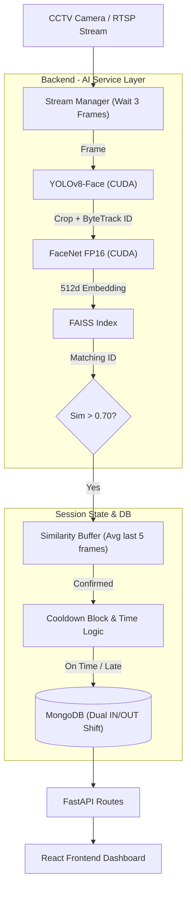

# Attendance AI: Enterprise CCTV Facial Recognition System

A state-of-the-art backend/frontend software architecture for processing massive real-time CCTV streams, autonomously recognizing faces, and compiling dense attendance shifts into an interactive web dashboard.

---

## ⚡ Core Architecture

The system utilizes an enterprise-grade `app` segregation, breaking logic into dedicated domains for scalability and maintenance.

### Flow Diagram



## 🏗 Enterprise Directory Structure

```text
attendance_ai/
├── backend/
│   ├── app/                      # Enterprise Architecture Namespace
│   │   ├── api/                  # FastAPI Application Controllers
│   │   │   └── routes/           # (students.py, attendance.py)
│   │   ├── core/                 # Foundation & Constants
│   │   │   ├── config.py         # ENV Ingestion
│   │   │   └── database.py       # Motor async connection pool
│   │   ├── models/               # Pydantic schemas required by API
│   │   ├── services/             # Distinct Business Logic
│   │   │   ├── face_engine.py    # YOLOv8 + FaceNet + FAISS CUDA Pipeline
│   │   │   └── stream_manager.py # Threading + Shift State Controller
│   │   ├── seed.py               # Bulk upsert CSV migration tool
│   │   └── main.py               # Uvicorn Bootstrapper
├── frontend/                     # React Server
│   ├── src/
│   │   ├── components/
│   │   │   └── dashboard/        # Decoupled stateless modules
│   │   ├── pages/                # Views (Dashboard.jsx)
│   │   └── services/             # Axios/Fetch api.js handler
├── .env                          # Secret Variables (See .env.example)
└── .gitignore                    # Comprehensive restriction overrides
```

## 🚀 Key Features

1. **YOLOv8 + ByteTrack Pipeline:** `MTCNN` is fully deprecated. Registration and frame parsing both rely entirely on `yolov8n-face.pt` running aggressively fast on GPU natively. Faces are dynamically tracked across frames before recognition, averting misidentifications from quick blur vectors.
2. **Half Precision (FP16):** Tensor operations for `InceptionResnetV1` run in `.half()` footprint mode, expanding concurrency threshold allowing massive 40-student 10FPS drops.
3. **Shift Tracking Configs:** Shift properties are stored inside `global_config` in MongoDB, instantly syncing IN/OUT behavior thresholds (e.g., Late vs On-Time vs Early Logout) dynamically off the frontend GUI without a hard reload.
4. **React Modularization:** The Dashboard is stripped away from unmaintainable inline components into segmented, independently scalable components (`ShiftSettings.jsx`, `StatCards.jsx`, `BranchBreakdown.jsx`, `ActivityFeed.jsx`).

## 🛠 Setup & Installation

**1. Database Configuration**
Ensure MongoDB is running locally (`mongodb://localhost:27017` or atlas).

Clone the `.env.example`:
```bash
cp .env.example .env
```

**2. Python Environment Setup**
```bash
cd backend
python -m venv venv
venv\Scripts\activate   # Windows
pip install -r requirements.txt
```

**3. Initializing AI & DB**
```bash
# Boot the server (auto-triggers seed.py if metadata.csv is populated)
python -m uvicorn app.main:app --host 0.0.0.0 --port 8000 --reload
```

**4. Frontend Launch**
```bash
cd frontend
npm install
npm run dev
```

Visit the frontend at `http://localhost:5173`. Shift Configurations are fully controllable via the global Settings module.
